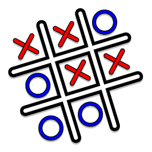

# Tic-Tac-Toe VS The World

 
Play Tic-Tac-Toe against the world! Vote for the cell to place your mark. The cell with the most votes wins. Simple, fun, and engaging!

## About
This game has the same rules as your regular Tic-tac-toe. However, it's now played in teams! During each turn, each team votes to select the cell they want to play in. The cell with the most votes is picked, and this process goes on forever!
 